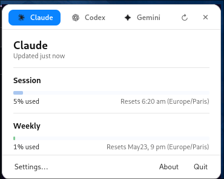
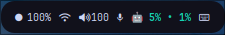
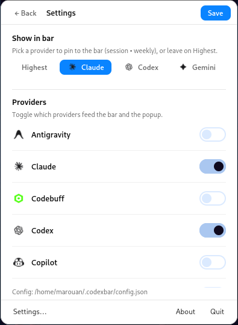

# codexbar-waybar

[](https://github.com/Marouan-chak/codexbar-waybar/actions/workflows/ci.yml)
[](LICENSE)

> AI provider usage in your [Waybar](https://github.com/Alexays/Waybar) — and a macOS-style popover when you click it.

[CodexBar](https://github.com/steipete/CodexBar) is a macOS menu-bar app that
surfaces Codex / Claude / Gemini / Copilot / … usage limits and reset windows.
It ships a Linux CLI but no desktop UI for Linux compositors.

This repo bridges that gap with two pieces:

- A **Waybar custom module** that polls the `codexbar` CLI and shows usage as
  `🤖 5% • 1%` (session • weekly) for a pinned provider, or `🤖 5%` for the
  most-constrained one across all enabled providers.
- A **GTK4 popover** modelled on the macOS menu — provider tab strip with
  real brand logos, flat sections, thin progress bars, reset countdowns,
  credit balances, and an inline Settings view for toggling providers and
  picking which one is pinned to the bar.

<p align="center">
  
</p>

<p align="center">
  
</p>

Validated on Arch Linux + Hyprland (HyDE), but should work on any Wayland
compositor with Waybar + gtk4-layer-shell.

## Features

- **Provider logos** in the tab strip and settings rows, sourced from
  upstream CodexBar (39 brand marks). Auto-recoloured for light backgrounds;
  see [`assets/providers/NOTICE`](assets/providers/NOTICE).
- **Bar pin mode** — choose `Highest` for cross-provider max, or pin a single
  provider to show its session and weekly side by side (`🤖 5% • 1%`).
  Toggled live from the popover's Settings view, no Save needed.
- **Inline Settings** — flips the popover body to a scrollable provider list
  with per-provider switches; macOS-only providers appear in their own
  greyed-out section.
- **OAuth → CLI fallback for Claude.** When Anthropic's OAuth endpoint
  rate-limits, the wrapper transparently retries via the local Claude CLI
  source so the bar never goes blank.
- **Antigravity via `agy` login and local SSL shim.** The CLI expects Antigravity's Google OAuth
  creds at `~/.codexbar/antigravity/oauth_creds.json` (written by the macOS
  app). The wrapper bridges the credentials that `agy login` drops at `~/.gemini/oauth_creds.json` on Linux. Additionally, it dynamically extracts the local Antigravity language server's self-signed TLS certificate and preloads a custom redirect shim (`cert_redirect.so`) to make the CLI trust local loopback connections without modifying the system CA store.
- **Last-good cache** at `~/.cache/codexbar-waybar/last.json`. Transient 429s
  or network blips reuse the previous value and surface as `stale` instead of
  blanking the bar.
- **Signal-driven refresh** (`pkill -RTMIN+8 waybar`) so a Settings change
  reflects on the bar within a second instead of waiting for the next tick.

## Requirements

- The `codexbar` Linux CLI from
  [steipete/CodexBar releases](https://github.com/steipete/CodexBar/releases/latest).
- [Waybar](https://github.com/Alexays/Waybar) 0.10+ (needs `signal` support
  on custom modules).
- `jq`, `python3`, `python-gobject` (PyGObject), `gtk4`, `gtk4-layer-shell`,
  `libadwaita` (optional but harmless), and a C compiler (`gcc`/`clang`/`cc`) for compiling the Antigravity SSL redirect shim.

### Arch Linux

```bash
sudo pacman -S waybar jq python-gobject gtk4 gtk4-layer-shell libadwaita
```

> **libxml2 gotcha**: Arch currently ships `libxml2.so.16` (2.15+); the
> CodexBar Linux tarball links against `libxml2.so.2`. Install the compat
> package:
>
> ```bash
> sudo pacman -S libxml2-legacy
> ```

### Debian / Ubuntu

```bash
sudo apt install waybar jq python3-gi gir1.2-gtk-4.0 gir1.2-gtk4layershell-1.0
```

### Install the codexbar CLI

Release assets are versioned (`CodexBarCLI-<tag>-linux-<arch>.tar.gz`), so
resolve the latest tag from the GitHub API rather than hard-coding it:

```bash
ARCH=x86_64   # or aarch64
TAG=$(curl -fsSL https://api.github.com/repos/steipete/CodexBar/releases/latest | grep -oP '"tag_name":\s*"\K[^"]+')
curl -fLO "https://github.com/steipete/CodexBar/releases/download/${TAG}/CodexBarCLI-${TAG}-linux-${ARCH}.tar.gz"
tar -xzf "CodexBarCLI-${TAG}-linux-${ARCH}.tar.gz"
install -m 0755 CodexBarCLI ~/.local/bin/codexbar
codexbar --help
```

Make sure you've already signed in via the providers' own CLIs (`codex login`,
`claude /login`, `gcloud auth application-default login` for Gemini,
`agy login` for Antigravity, etc.).
The CLI bootstraps a `~/.codexbar/config.json` with Codex enabled by default
the first time it runs; use the popover's Settings view to toggle Claude,
Gemini, or anything else on without hand-editing JSON.

## Install codexbar-waybar

Clone and run the installer:

```bash
git clone https://github.com/Marouan-chak/codexbar-waybar.git
cd codexbar-waybar
./install.sh
```

The installer:

- Copies `codexbar.sh` and `codexbar-popup.py` to `~/.config/waybar/scripts/`.
- Drops `codexbar.jsonc` as `~/.config/waybar/modules/custom-codexbar.json`.
- Appends `codexbar.css` to `~/.config/waybar/user-style.css` (idempotent).
- Installs provider SVGs to `~/.local/share/codexbar-waybar/icons/`.

The one manual step is wiring `custom/codexbar` into your `config.jsonc`. For
a hand-curated config, add it to a `modules-right` group:

```jsonc
"group/pill#right1": {
  "modules": ["backlight", "pulseaudio", "custom/codexbar", "clock"]
}
```

Reload Waybar (`Ctrl+Alt+W` on HyDE, or `pkill waybar; waybar &`).

## Usage

- **Left-click** the `🤖 …%` segment → opens the popover (click again to
  close).
- **Right-click** → `notify-send` summary, no GUI.
- **Tab strip** in the popover switches the active provider's card.
- **Settings → Show in bar** picks which provider the bar pins to, or
  reverts to `Highest`. Selection writes
  `~/.config/codexbar-waybar/state.json` and signals waybar immediately.
- **Settings → Providers** toggles which providers feed the bar and popover.
  *Save* writes `~/.codexbar/config.json` and triggers a refresh.

<p align="center">
  
</p>

- **ESC** or the `✕` button closes the popover.

## Tuning

Each knob is an environment variable; set it inside the Waybar module
definition or your shell profile.

| Variable | Default | Purpose |
| --- | --- | --- |
| `CODEXBAR_BIN` | `~/.local/bin/codexbar` | Path to the CLI binary. |
| `CODEXBAR_STAGGER` | `0.5` | Seconds between provider fetches (raise it if Claude OAuth keeps 429-ing). |
| `CODEXBAR_PROVIDERS` | from `config.json` | Space-separated provider IDs to query, bypassing `~/.codexbar/config.json`. Set per-Waybar instance if you want different sets per monitor. |
| `CODEXBAR_BAR_PROVIDER` | from `state.json` | Pin a specific provider's session/weekly to the bar regardless of state. Set to a provider ID, or unset for `Highest`. |
| `CODEXBAR_ANTIGRAVITY_CREDS` | `~/.gemini/oauth_creds.json` | Path to the Antigravity Google OAuth creds (written by `agy login`) the wrapper feeds to the CLI. |
| `CODEXBAR_LAYER_SHELL_LIB` | auto-detected | Override path to `libgtk4-layer-shell.so` if your distro stashes it somewhere unusual. |
| `XDG_CACHE_HOME` | `~/.cache` | Where `last.json` snapshots live. |
| `XDG_DATA_HOME` | `~/.local/share` | Where provider icons live (under `codexbar-waybar/icons/`). |

To change which providers appear, open the popover and click **Settings…** —
the inline view lets you toggle providers and Save back to
`~/.codexbar/config.json`. Codex and Claude need `--source oauth` on Linux;
the wrapper sets that automatically via `SOURCE_OVERRIDES` at the top of
`codexbar.sh` and falls back to `--source cli` on errors where the CLI source
is available (currently: Claude).

## How it works

1. Waybar runs `codexbar.sh` every 30 s (or whenever it receives
   `SIGRTMIN+8`).
2. The script reads `~/.codexbar/config.json` to learn which providers are
   enabled, then invokes `codexbar usage --provider <p> --format json` once
   per enabled provider, sequentially, with a small stagger.
3. Each response is the same JSON payload the macOS menu-bar app consumes:
   primary / secondary / tertiary usage windows, reset timestamps, credit
   balances, error info. Claude OAuth 429s trigger a transparent retry via
   `--source cli` so the bar keeps working off the local Claude CLI logs.
4. The wrapper collapses the merged payload into Waybar's JSON contract
   `{"text", "tooltip", "class", "percentage"}`. The `text` field honours
   `~/.config/codexbar-waybar/state.json` (pinned provider) or falls back to
   the highest `usedPercent` across all responses.
5. The latest successful per-provider response is cached at
   `~/.cache/codexbar-waybar/last.json`. The popover paints from the cache
   for an instant first frame and then refetches in the background.
6. The popover is a GTK4 + `gtk4-layer-shell` window anchored to the
   top-right of the focused output. SVG provider logos are mirrored from
   upstream CodexBar (MIT) and recoloured at load time for the light panel.

## States and styling

The Waybar module emits one of these classes; style them in
`~/.config/waybar/user-style.css`:

| Class | Meaning |
| --- | --- |
| `ok` | `0 ≤ percentage < 70` |
| `warning` | `70 ≤ percentage < 90` |
| `critical` | `percentage ≥ 90` |
| `stale` | All providers errored, or any value came from cache |

## Troubleshooting

| Symptom | Likely fix |
| --- | --- |
| `libxml2.so.2: cannot open shared object file` | Install your distro's libxml2 v2.13 compat (`libxml2-legacy` on Arch). |
| Module text is blank | Run `~/.config/waybar/scripts/codexbar.sh` directly — it should print one JSON line. |
| Popover never shows | Run `~/.config/waybar/scripts/codexbar-popup.py` from a terminal; check the warnings. The most common one is `gtk4-layer-shell` not preloading — set `CODEXBAR_LAYER_SHELL_LIB`. |
| `HTTP 429 rate_limit_error` from Claude | The wrapper already falls back to the local Claude CLI source. If you still see persistent errors, raise `CODEXBAR_STAGGER=1.0` and the module `interval` to 60. |
| Provider logos look like blank squares | Re-run `./install.sh` to refresh `~/.local/share/codexbar-waybar/icons/`. |
| Bar pin doesn't update instantly | Make sure your Waybar module def has `"signal": 8` (the bundled `codexbar.jsonc` already does). |

## Roadmap

- Auto-dismiss the popover on outside click (today: ESC, `✕`, or clicking the
  bar icon).
- Dark-mode palette (auto-detect from `gsettings color-scheme` or HyDE
  wallbash).
- AUR `PKGBUILD` for one-shot install on Arch.
- Optional Quickshell variant for compositors without Waybar.

## Related

- [CodexBar](https://github.com/steipete/CodexBar) — the upstream macOS app
  and Linux CLI this project wraps.
- [Win-CodexBar](https://github.com/Finesssee/Win-CodexBar) — Windows port of
  the macOS app.

## Contributing

PRs and issues welcome — see [CONTRIBUTING.md](CONTRIBUTING.md). Bug reports
go through the GitHub issue templates; anything about the `codexbar` CLI
itself belongs in the
[upstream tracker](https://github.com/steipete/CodexBar/issues) instead.

## License

MIT. See [LICENSE](LICENSE). Provider SVG marks are redistributed from
upstream CodexBar under the same MIT license (see
[`assets/providers/NOTICE`](assets/providers/NOTICE)); the individual brand
marks remain the property of their respective owners.
